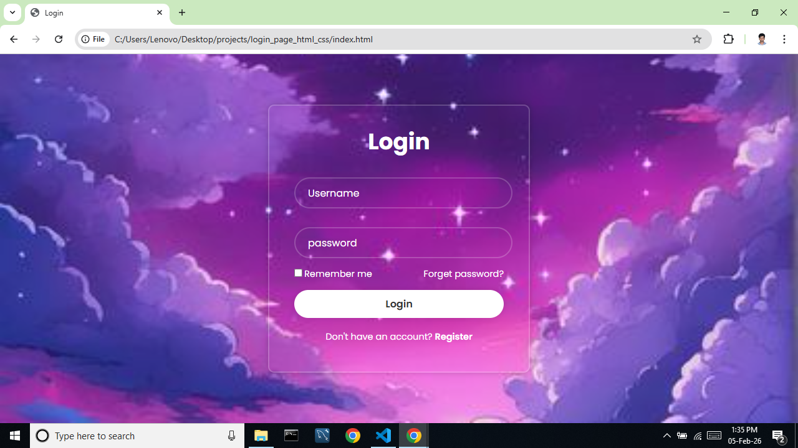
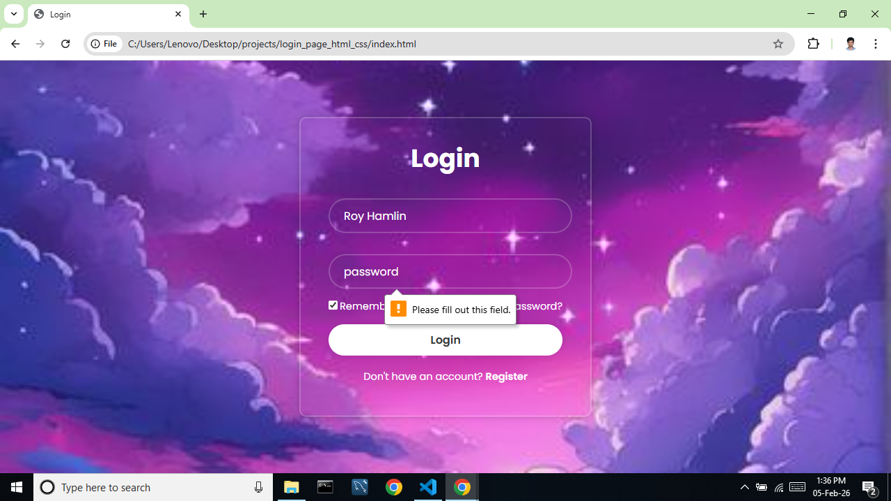

# ✨ Modern Login Form

A modern, responsive **Login Form UI** built using **HTML5 and CSS3**.  
This project features a **glassmorphism-style design**, clean typography using the **Poppins** font, and a user-friendly layout suitable for authentication pages in web applications.

---

## 🚀 Features

- Responsive login form layout
- Glassmorphism UI with blur and transparency
- Username and password input fields
- "Remember me" checkbox
- "Forgot password?" link
- Registration call-to-action
- Clean and modern user experience
- Frontend-only implementation (no backend)

---

## 🛠️ Tech Stack

- **HTML5** – Semantic structure
- **CSS3** – Styling, layout, and effects
- **Google Fonts** – Poppins

---

## 📂 Project Structure

```
Login_Page/
├── index.html
├── style.css
├── download.jpg
└── screenshots/
    └── login-page1.png
    └── login-page2.png

```

---

## ⚙️ Installation & Usage

1. Clone or download the repository.
2. Place all files in the same directory.
3. Replace `download.jpg` with your preferred background image (optional).
4. Open `index.html` in any modern web browser.

_No dependencies or build tools required._

---

## ▶️ How It Works

- The login form is centered using Flexbox.
- Inputs use HTML5 validation (`required`).
- The UI applies a glassmorphism effect using transparency and blur.
- Buttons and links include hover states for better UX.
- This project focuses purely on **frontend UI**, without authentication logic.

---

## 🎨 UI Highlights

- Glassmorphism design with subtle borders and shadows
- Fully centered layout across screen sizes
- Rounded input fields and buttons
- High contrast text for readability
- Clean typography using the Poppins font

---

## 📸 Screenshot

```md
### 1. Login Screen


### 2. Working Screen


---

⭐ If you find this project useful, feel free to star the repository.